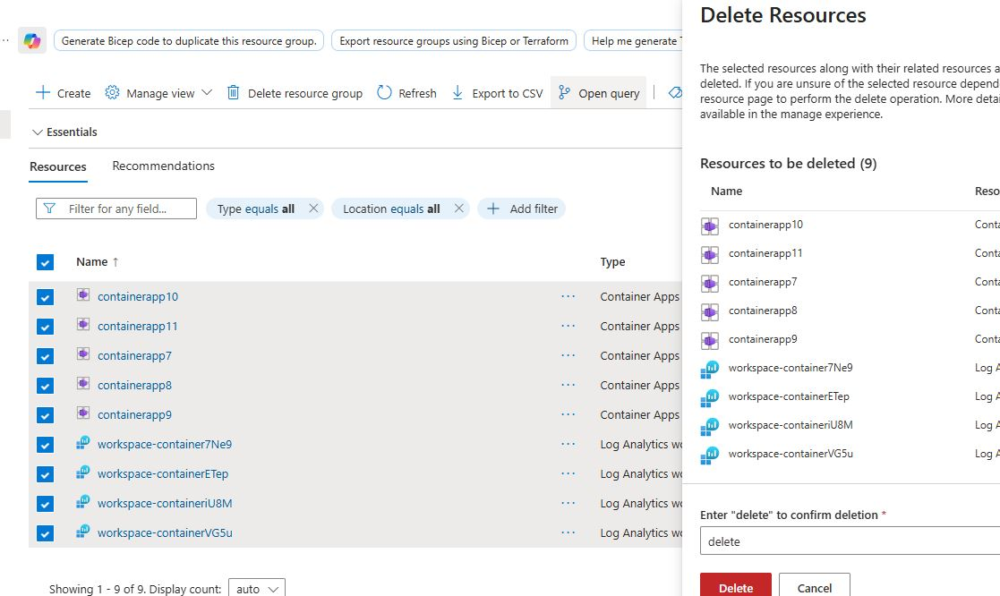

## Step 1 — Create a Service Principal in Azure

To allow GitHub Actions to authenticate and deploy resources on Azure, create a Service Principal using the Azure CLI:

```bash
az ad sp create-for-rbac \
  --name "github-actions-sp" \
  --role contributor \
  --scopes /subscriptions/<YOUR_SUBSCRIPTION_ID>/resourceGroups/<RESOURCE_GROUP> \
  --sdk-auth
```

That is going to generate JSON as following:

```json
{
  "clientId": "...",
  "clientSecret": "...",
  "subscriptionId": "...",
  "tenantId": "...",
  "activeDirectoryEndpointUrl": "https://login.microsoftonline.com",
  "resourceManagerEndpointUrl": "https://management.azure.com/",
  "activeDirectoryGraphResourceId": "https://graph.windows.net/",
  "sqlManagementEndpointUrl": "https://management.core.windows.net:8443/",
  "galleryEndpointUrl": "https://gallery.azure.com/",
  "managementEndpointUrl": "https://management.core.windows.net/"
}
```

Which will be saved in secrets from Github Actions as AZURE_CREDENTIALS

## Step 2 — Update Role of Service Principal

```bash
az role assignment create \
  --assignee "<clientId>" \
  --role "User Access Administrator"\
  --scope /subscriptions/<YOUR_SUBSCRIPTION_ID>/resourceGroups/<RESOURCE_GROUP>
```

In order to be able to access the image inside the ACR, it is needed for the Service Principal to have User Access Administrator as a role

## Step 3 — Deleting resources inside resource group

- Open the database console at Aiven Console: https://console.aiven.io/ (Since it’s a free tier service, it may enter sleep mode after some time);
- To avoid unnecessary costs, you can safely delete all resources inside the created resource group. If you run the workflow again, everything will be automatically recreated. Just keep the same empty resource group and the Service Principal created in steps 1 and 2.
  


